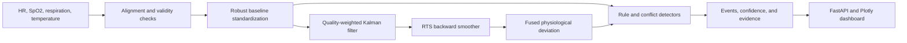

# Multimodal Vital-Signs Anomaly Detector

I built this project to turn multimodal physiological reconciliation into a runnable and inspectable monitoring pipeline. It aligns heart rate, oxygen saturation, respiration rate, and temperature; estimates a quality-aware latent physiological state; smooths that estimate using future and past evidence; and identifies clinically recognizable signal patterns without hiding the decision path behind a remote model API.

> **Important:** This is a research and portfolio project, not a certified medical device or diagnostic tool. It must not be used for diagnosis, treatment, monitoring, triage, or other clinical decisions. Do not submit identifiable patient information.

## What it does

- Aligns multi-rate or irregularly sampled vital signs onto a shared time grid
- Preserves observation masks and assigns lower confidence to imputed, noisy, or invalid readings
- Robustly standardizes each modality relative to its baseline
- Fuses modalities with a quality-aware state-space filter and Rauch–Tung–Striebel backward smoother
- Detects oxygen desaturation, irregular heart-rate patterns, abnormal respiration, temperature elevation, cross-sensor conflict, and fused instability
- Returns event timing, severity, evidence, and a bounded confidence score
- Exposes a FastAPI service and a responsive Plotly dashboard
- Includes a deterministic sample generator and standalone plotting demo

## Dataset choice and access terms

I use a deterministic synthetic multi-signal generator as the default dataset. This choice is deliberate: MIT-BIH Arrhythmia is openly accessible but primarily provides ECG-derived cardiac signals, while MIMIC waveform data with synchronized heart rate, SpO₂, respiration, and temperature can require credentialing and is too large for a frictionless portfolio clone.

The generator creates physiologically plausible baselines and explicitly injects desaturation, irregular heart-rate variation, temperature drift, missing intervals, impulsive noise, and sensor corruption. Its code and generated samples are released with this repository under the MIT License. No real or identifiable patient data is included. Synthetic behavior is useful for software validation, but it does not establish clinical validity.

The pipeline also accepts user-supplied JSON windows through `POST /analyze`, so an approved public or institutional dataset can be integrated later without changing the fusion layer.

## Why a state-space model

A Transformer is useful when a large labeled corpus can teach complex long-range temporal representations. This repository instead targets limited, noisy, partially missing biomedical streams. A state-space model is smaller, deterministic, uncertainty-aware, and easier to audit.

Each channel is converted to a robust deviation from its baseline. SpO₂ is sign-inverted so deterioration has the same direction as elevated heart rate, respiration, or temperature. Measurement variance is adjusted by signal quality, a robust Kalman update estimates the latent deviation, and backward smoothing reconciles each estimate with the complete window.



Confidence combines normalized event severity with mean data quality across the event. It is an engineering confidence score, not a calibrated probability of disease.

## Project structure

```text
vitals-fusion-anomaly-detector/
├── app/
│   ├── data/                 synthetic data and preprocessing
│   ├── detection/            thresholds, confidence, event aggregation
│   ├── fusion/               robust filtering and backward smoothing
│   ├── static/               HTML, CSS, JavaScript, and Plotly dashboard
│   ├── config.py
│   ├── main.py               FastAPI application
│   ├── pipeline.py
│   └── schemas.py
├── scripts/
│   ├── demo_fusion.py        saves an explanatory fusion plot
│   └── generate_sample.py    writes a reproducible sample CSV
├── tests/                    preprocessing, fusion, detection, and API tests
├── Dockerfile
├── docker-compose.yml
├── requirements.txt
└── .env.example
```

## Local setup

Python 3.11 or 3.12 is recommended.

```bash
git clone https://github.com/sattipraveena3-sudo/vitals-fusion-anomaly-detector.git
cd vitals-fusion-anomaly-detector
python -m venv .venv
source .venv/bin/activate        # Windows: .venv\Scripts\activate
python -m pip install -e ".[dev]"
cp .env.example .env            # PowerShell: Copy-Item .env.example .env
ruff check app scripts tests
ruff format --check app scripts tests
pytest -q
uvicorn app.main:app --reload
```

Open `http://localhost:8000`. Interactive API documentation is at `http://localhost:8000/docs`.

## Docker

```bash
cp .env.example .env
docker compose up --build
```

Then open `http://localhost:8000`.

## API

Analyze the built-in sample:

```bash
curl -X POST http://localhost:8000/analyze \
  -H "Content-Type: application/json" \
  -d '{"sample_id":"synthetic-default","target_frequency_hz":1.0}'
```

For a custom window, replace `sample_id` with a `signals` object containing equally sized `timestamps`, `heart_rate`, `spo2`, `respiration_rate`, and `temperature` arrays. Missing readings are represented as `null`.

```bash
curl http://localhost:8000/health
```

## Standalone demonstration

```bash
python scripts/generate_sample.py
python scripts/demo_fusion.py
```

The first command creates `data/sample_vitals.csv`. The second creates `artifacts/fusion_demo.png` with raw signals, fused state, uncertainty, and highlighted event regions.

## Testing

```bash
ruff check app scripts tests
ruff format --check app scripts tests
pytest -q
```

Tests cover resampling and alignment, missing and invalid readings, fusion output shape and numerical sanity, quality-based outlier down-weighting, expected anomaly thresholds, API response structure, and request validation. GitHub Actions runs the full suite on Python 3.11 and 3.12, builds the wheel, and verifies the production container.

## Known limitations

- Synthetic events do not reproduce the full heterogeneity of real patients, devices, or care settings.
- Thresholds are transparent engineering defaults, not clinically validated operating points.
- Robust baseline estimation assumes the first portion of a window is mostly representative.
- A single latent state cannot express every independent physiological mechanism.
- Linear interpolation is limited but can still soften short, sharp events.
- Confidence scores are not calibrated against clinician annotations.
- The Plotly dashboard loads its browser library from a CDN.

## What I would improve next

I would validate on a properly authorized synchronized waveform cohort, add channel-specific sampling adapters, learn process and measurement noise from training data, compare the state-space model with a compact masked Transformer, add online filtering for streaming use, calibrate confidence with held-out labeled events, add geodesic and spectral ECG features, evaluate subgroup performance, and conduct prospective clinical and regulatory review before any medical use.

## Suggested incremental commits

1. `set up project scaffolding and configuration`
2. `add reproducible multimodal vital-sign generator`
3. `implement signal alignment and quality tracking`
4. `add robust state-space fusion model`
5. `add backward-consistent smoothing`
6. `implement physiological anomaly detectors`
7. `add confidence scoring and event aggregation`
8. `add FastAPI health and analysis endpoints`
9. `build interactive Plotly monitoring dashboard`
10. `add preprocessing fusion detection and API tests`
11. `add Docker Compose and demonstration scripts`
12. `document architecture dataset terms and limitations`

## Progressive Git and GitHub CLI workflow

The repository is already published. To recreate a gradual history locally, create each component in order and stage only the named files before its commit.

```bash
mkdir vitals-fusion-anomaly-detector && cd vitals-fusion-anomaly-detector
git init -b main

git add app/__init__.py app/config.py app/schemas.py pyproject.toml .env.example .gitignore
git commit -m "set up project scaffolding and configuration"

git add app/data/synthetic.py
git commit -m "add reproducible multimodal vital-sign generator"

git add app/data/preprocessing.py
git commit -m "implement signal alignment and quality tracking"

git add app/fusion/state_space.py
git commit -m "add robust state-space fusion model"

git add app/fusion/state_space.py
git commit -m "add backward-consistent smoothing"

git add app/detection/detector.py
git commit -m "implement physiological anomaly detectors"

git add app/detection/detector.py app/pipeline.py
git commit -m "add confidence scoring and event aggregation"

git add app/main.py
git commit -m "add FastAPI health and analysis endpoints"

git add app/static
git commit -m "build interactive Plotly monitoring dashboard"

git add tests requirements.txt
git commit -m "add preprocessing fusion detection and API tests"

git add Dockerfile docker-compose.yml Makefile scripts
git commit -m "add Docker Compose and demonstration scripts"

git add README.md LICENSE
git commit -m "document architecture dataset terms and limitations"

gh auth login
gh repo create vitals-fusion-anomaly-detector --public --source=. --remote=origin
git push -u origin main
```

If the empty remote repository already exists:

```bash
git remote add origin https://github.com/sattipraveena3-sudo/vitals-fusion-anomaly-detector.git
git push -u origin main
```

## License

MIT
